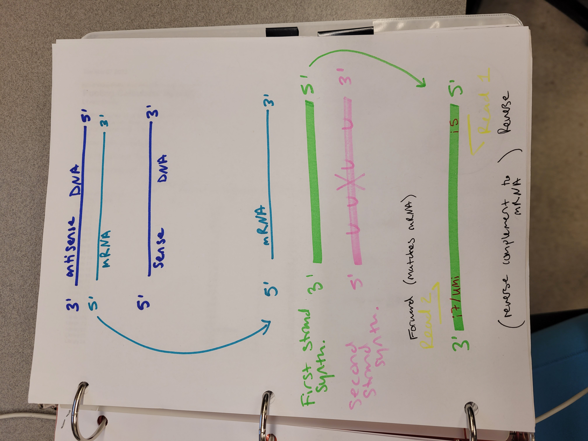

# C. elegans Intestine RNAseq

---
## Experiment Background

RNAseq of hand dissected intestine sections from L4 stage N2 worms.

The NEBNext Ultra II directional RNA library prep kit (E7760S) was used in combination with the NEBNext Multiplex Oligos for illumina (UMI adaptors RNA set 1, NEB #E7416)

This kit contains dUTP in the second strand synthesis buffer that allows labeling of the second strand cDNA and subsequent excision with USER Enzyme. Leaving behind only the first strand! 

5' -------------> 3'  (read 2)

3' <------------- 5'  (read 1)

Paired end sequencing was performed.

The directionality of this library is: 
  - read 1 is "reverse", so antisense 
  - read 2 is "forward", so sense
  

**Why perform stranded RNA-seq?**

- Allows researchers to determine the orientation of a transcript and differentiate between the sense (coding) and antisense (complementary) strands of a gene.
- Can help identify which transcripts are expressed or changing expression levels in experimental systems where genes on opposite DNA strands overlap. 
- Can help identify non-coding antisense transcripts.
- Because stranded RNA-seq retains strand information of a read, we can resolve read ambiguity in overlapping genes transcribed from opposite strands, which provides a more accurate quantification of gene expression levels compared with traditional non-stranded RNA-seq.
- References:
  - Zhao, S., Zhang, Y., Gordon, W. et al. Comparison of stranded and non-stranded RNA-seq transcriptome profiling and investigation of gene overlap. BMC Genomics 16, 675 (2015). https://doi.org/10.1186/s12864-015-1876-7

---

## Scripts for RNAseq pipeline on Alpine 

## (find in the scripts directory)

### Pipeline 1

- fastp.sbatch (need to convert into an array job!) 
  - Specify UMI in the read index
  - Use options: 
    - -U 
    - --umi_loc=read1
    - --umi_len=19

Illumina kits: Dual-indexed libraries—Adds **Index 1 (i7)** and **Index 2 (i5)** sequences to generate uniquely tagged libraries.

- hisat2_array.sbatch 
  - Specify the RNA strandedness
  - Use options: 
    - --rna-strandedness RF
  - For single-end reads, use F or R. For paired-end reads, use FR or RF. Where the firststrand corresponds to R and RF, and the secondstrand corresponds to F and FR.

- FeatureCounts_array.sbatch   (no way to account for UMIs in counting) 
  - Specify strand-specific read counting 
  - Use options: 
    - -s 2
  - -s specifies strand-specific read counting. 0 for unstranded reads, 1 for stranded reads and 2 for reversely stranded reads. This depends on the library used in the sequencing protocol.
  
---

---

### Pipeline 2

- ...
- ... 
