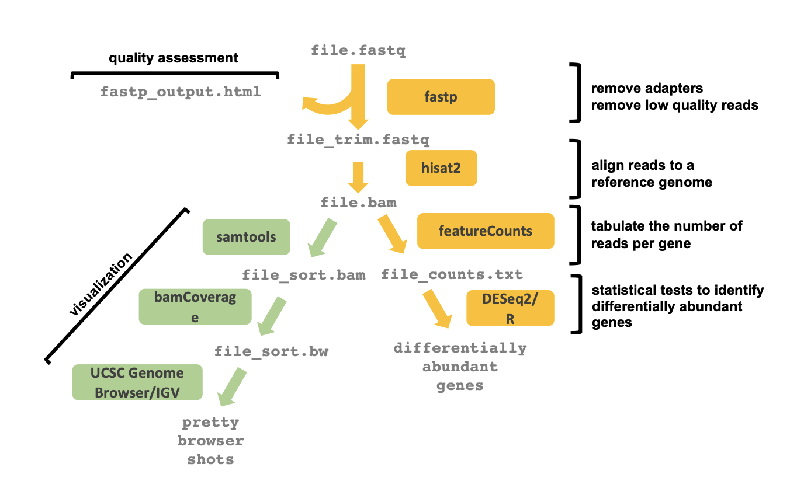

# C. elegans Intestine RNAseq

RNAseq of hand dissected intestine sections

NEBNext Ultra II directional RNA library prep kit, with UMI adapters was used.

---

### Scripts for RNAseq pipeline on Alpine

- fastp.sbatch (need to convert into an array job!)
- hisat2_array.sbatch
- FeatureCounts_array.sbatch

--- 

